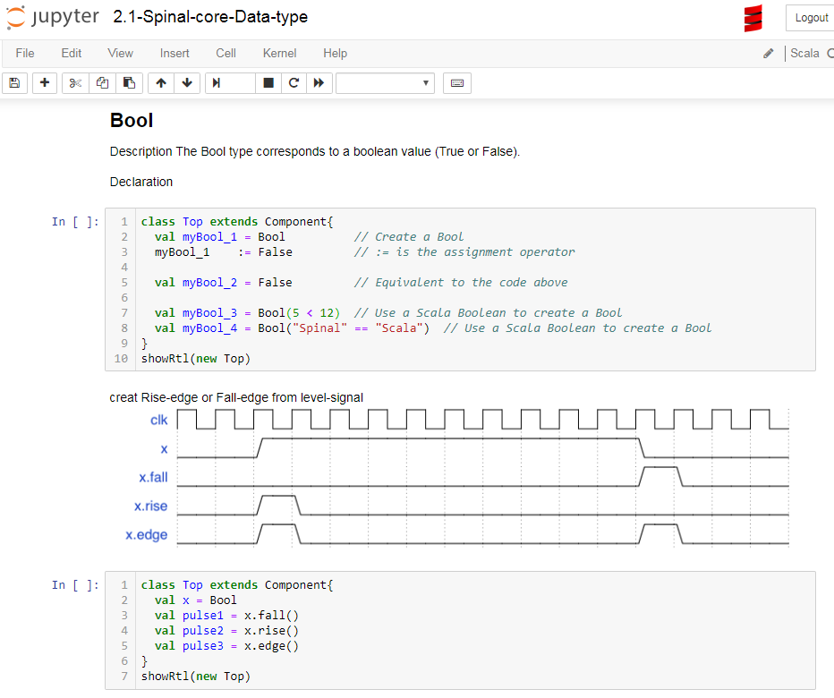

## Spinal-bootcamp [](https://mybinder.org/v2/gh/jijingg/Spinal-bootcamp/binder)

This is SpinalHDL Tutorial, More important, it's a spinalHDL run-time environment.

<div align="center"></div>

Most of case come from [SpinalDoc](https://spinalhdl.github.io/SpinalDoc-RTD/index.html),
In addition, we also introduced some advanced usage of Scala, which are very helpful to understand how spinalHDL works.

  **Why we do such a thing:**
- Sometimes you just want to try a usage of a Spinal or Scala, but you don't want to create a new project.
- Practice is important for learning a new skill. So we did a lot of examples for you to try run.

## Usage

There are two ways, you can run online or locally

### Online 

click [](https://mybinder.org/v2/gh/jijingg/Spinal-bootcamp/binder) and start 

### Local

```shell
$: git clone https://github.com/jijingg/Spinal-bootcamp
$: cd Spinal-bootcamp
$: jupyter notebook &
```
 
## Setup Jupyter-notebook enviroment 

if you want run locally, install follows first 
- [jupyter-notebook](https://jupyter.org/install)(Strongly recommend installing Python and Jupyter using the [Anaconda](https://www.anaconda.com/distribution/))
- scala(Scala2.12 is recommended)
- [almond](https://almond.sh/)(scala kernel for jupyter) 


## Before the start

  We assume you already have the basics knowledge of Scala，So there is no introduction to scala syntax here.  
If you need to learn Scala, I would strongly recommend the book of **["Programming in Scala"](https://www.oreilly.com/library/view/programming-in-scala/9780981531687/)** by Martin Odersky who is also the author of Scala. And just 
try them as many as you can on jupyter notebook env, This may be more efficient to help you master Scala than just reading a book without practice.

## FAQ

1. Make sure the right version have been installed.

- Java Version jdk1.8 (java11 not supported yet)
- Scala Version 2.12.x (2.13.x not supported yet)
- Almond Version  0.5.0 is recommended

install Almond on MacOs
```shell
brew install coursier/formulas/coursier
cs launch --fork almond:0.5.0 --scala 2.11.12 -- --install --force
```
